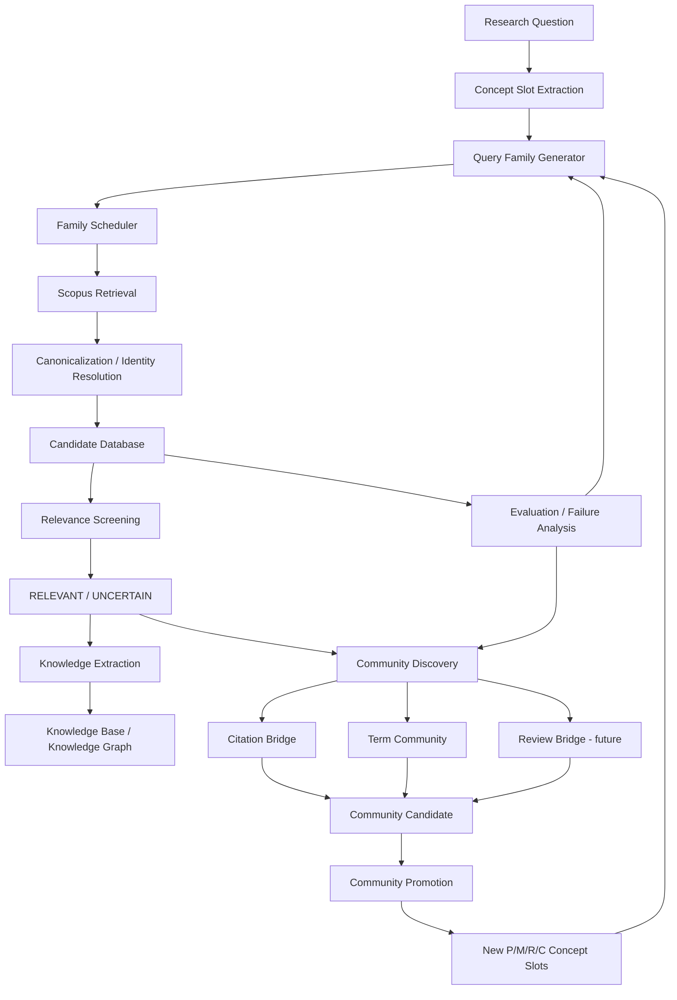

# Materials Knowledge Base / Comprehensive Literature Discovery Agent

> 面向材料科学研究的“尽可能搜全”型文献发现与知识库构建系统。当前核心研究问题不是“把最相关的几篇排在前面”，而是：**如何尽可能完整地发现一个研究主题下的相关论文，并能够量化检索系统仍然漏掉了什么、为什么漏，以及下一步应该如何自动扩展搜索空间。**

---

## 1. 项目目标

传统文献检索系统通常优化的是 Top-K 相关性、搜索排序或推荐准确率；本项目的目标不同。

我们希望构建的是一个 **Comprehensive Literature Discovery Agent**：

```text
Research Question
    ↓
尽可能高召回地发现相关论文
    ↓
保存全部 Candidate Papers
    ↓
相关性判断 / 证据审计
    ↓
Knowledge Base / Knowledge Graph
    ↓
发现新的研究方向、机制、材料、应用社区
    ↓
自动生成新的 Query Families
    ↓
再次搜索
    ↓
不断扩展数据库
```

最终目标不是“返回十篇最相关论文”，而是：

> **构建一个尽可能完备、可审计、可持续扩展的领域文献数据库，并为后续知识图谱、研究空白发现和研究假设生成提供可靠底座。**

当前主要以 **光固化 / 光聚合体系中的 polymerization shrinkage / shrinkage stress** 作为测试主题，验证整套通用方法。

---

# 2. 项目核心原则

## 2.1 搜索结果优先保存，不因预算直接删除

系统当前采用三层数据结构。

### Layer 1 — Candidate Database

所有检索到的 unique papers 都先进入候选数据库。

```text
Scopus / OpenAlex Retrieval
        ↓
Canonicalization / Dedup
        ↓
Candidate DB
```

这一层的原则是：

> **只要搜索组件发现了论文，就应该留下记录。**

不会因为 family budget、ranking、LLM 处理预算或当前相关性分数较低而直接物理删除论文。

至少保留：

```text
EID
OpenAlex W-id
DOI
title
abstract
year
venue
query_id
family_id
retrieval rank
retrieved_at
provenance
leakage flag
```

### Layer 2 — Relevance Layer

Candidate Paper 再进行三态判断：

```text
RELEVANT
UNCERTAIN
IRRELEVANT
```

其中 `IRRELEVANT` 也推荐保留记录，只改变状态，不物理删除。这样可以避免重复判断、保留审计轨迹，并支持后续重新评估。

### Layer 3 — Knowledge Base / Knowledge Graph

只有 `RELEVANT` 与部分 `UNCERTAIN` 进入成本更高的全文解析、机制抽取、材料/反应/方法/效果抽取、知识图谱与社区发现。

因此：

> **K / batch budget 只能控制“先处理谁”，不能控制“谁有资格被数据库保存”。**

---

# 3. 总体系统架构



系统可以理解为两个闭环。

### Retrieval Loop

```text
Research Question
→ Query Family
→ Search
→ Candidate DB
→ Failure Analysis
→ Query Improvement
```

### Discovery Loop

```text
Relevant Literature
→ Citation / Term / Review Signals
→ New Community
→ New Concept Slots
→ New Query Family
→ Search
→ New Literature
```

---

# 4. Query Architecture：v2.0

v1 的核心问题是 **Anchor Collapse**。

早期 22 个 query 几乎全部围绕：

```text
"bulk-fill composite"
```

因此系统主要进入 dental bulk-fill 社区，而大量历史 polymerization shrinkage、volumetric contraction、shrinkage stress、optical / photopolymer、ring-opening 和非 dental photopolymer 社区难以进入候选集。

v2.0 将 Research Question 拆成四类 Concept Slot：

```python
SLOT_NAMES = (
    "problem",
    "material",
    "reaction",
    "context",
)
```

对应：

```text
P = Problem / phenomenon
M = Material / system
R = Reaction / mechanism
C = Context / application
```

然后生成 Query Families：

```text
FAM-P       Problem only
FAM-PM      Problem × Material
FAM-PR      Problem × Reaction / Mechanism
FAM-PC      Problem × Context / Community
FAM-STRESS  Stress-specific lexical family
FAM-VOLUME  Volume / dimensional-change family
```

当前模块：

```text
search_engine/query/
├── concept_slots.py
├── query_family.py
├── variant_generator.py
├── family_registry.py
└── family_scheduler.py
```

工具：

```text
tools/
├── build_query_families.py
├── run_query_families.py
└── evaluate_query_diversity.py
```

当前生成规模：

```text
50 query families
147 generated queries
```

---

# 5. Query Diversification 指标

## 5.1 Anchor Concentration

衡量 query 是否仍然被一个固定 anchor 支配。

```text
v1: AC ≈ 1.0
v2: AC = 0.238
```

说明 query 已经从单一 `bulk-fill composite` anchor 转变为多 family 搜索。

## 5.2 Family Coverage

```text
FC = executed families / planned families
```

当前：

```text
50 / 50 = 100%
```

## 5.3 Marginal Family Contribution

用于判断 family 是否真的扩展 retrieval frontier，而不是仅重复其他 family。

例如 `FAM_VOLUME` 的 MFC 接近 1，说明 volume / contraction 语言带来了大量其他 family 没有触达的新论文。

---

# 6. 文献身份与 Canonicalization

系统优先使用稳定标识符进行论文去重和跨源映射：

```text
Scopus EID
OpenAlex W-id
DOI
```

在 Scopus 检索评估中，`EID exact` 是最可靠的 identity basis。

此前评估曾因为只使用 OpenAlex W-id 映射造成严重漏匹配；改为 EID exact 后恢复为真实结果。因此当前原则是：

> **在数据源原生 ID 可用时，优先使用原生 exact identity；不要为了统一格式过早跨库映射。**

---

# 7. 评估系统：QGS / Relative Recall

项目不假设自己已经知道“全世界所有相关论文”，因此不直接声称计算 absolute recall，而使用外部独立构建的 **Quasi-Gold Standard（QGS）**。

当前 QGS v1 最终冻结：

```text
B_total            = 140
B_scopus           = 134
NOT_IN_SCOPUS      = 5
NOT_CHECKABLE      = 1
Scopus Coverage    = 95.71%
```

其中 134 篇是已确认 relevant 且在 Scopus 中存在、拥有 EID 正向证据的 benchmark papers。

因此：

\[
RR = \frac{|R_{Agent}\cap B_{Scopus}|}{|B_{Scopus}|}
\]

这里的 RR 应理解为：

> **Relative Recall / Regression Recall**，不是全世界绝对召回率。

---

# 8. QGS v1 构建原则

QGS 并不是从 Agent 搜索结果中人工补出，而是通过独立 external source reviews 构建。

```text
Independent Reviews
        ↓
Reference Extraction
        ↓
Identity Resolution
        ↓
Human Relevance Screening
        ↓
Scopus Eligibility Audit
        ↓
Consistency Audit
        ↓
Human Sign-off
        ↓
FINAL_FREEZE
```

核心防污染原则：

1. Agent 开发过程中使用过的 review 不进入独立 QGS source set；
2. QGS relevant papers 不直接硬编码到 query；
3. QGS missed DOI / title 不允许作为正式搜索 seed；
4. QGS v1 一旦用于开发诊断，就只能继续作为 regression benchmark；
5. 最终 v2 泛化能力必须使用新的 independent QGS v2。

---

# 9. v1 → v2.0 的主要实验结果

### v1

v1 检索前端高度依赖 `bulk-fill composite`。

标准化 retrieval-level benchmark：

```text
4 / 134 = 2.99%
```

并且：

```text
PRE_2006 ≈ 0%
```

主要表现为 severe direction / community gap。

### v2.0 Query-Family Diversification

Query family 架构上线后：

```text
AC:        ~1.0 → 0.238
queries:   22 → 147
families:  ~1 dominant family → 50 families
```

并显著扩大 retrieval frontier。

---

# 10. Depth Diagnosis：v2.0.1

系统进一步测试：现有 query 已经正确，但是否因为 Scopus 只导出 Top-N 导致重要论文排名太深而漏掉？

标准化 depth experiment：

| depth | QGS Candidate Recall |
|---:|---:|
| 100 | 22.4% |
| 200 | 35.8% |
| 500 | 53.7% |
| 1000 | **61.9%** |

说明 `depth=100 → 1000` 是一个非常大的 recall bottleneck 修复。

同时：

```text
PRE_2006 recall = 26/58 = 44.8%
```

v1 的历史文献盲区被明显穿透。

但是继续：

```text
depth 1000 → 2000
```

对真正仍未进入 Candidate DB 的 41 篇：

```text
新增 = 0
```

因此目前冻结结论：

> **100→1000 有重大价值；1000→2000 对当前 unresolved set 已没有明显新增价值。**

---

# 11. Candidate Recall 才是数据库建设阶段的核心指标

此前系统曾计算 `RR_retained(K=200)`，但后续明确：对“构建数据库”目标，family budget 不应该决定 candidate 是否保存。

当前核心指标改为：

\[
Recall_{Candidate} =
\frac{\text{QGS 中进入 Candidate DB 的论文}}{134}
\]

当前：

```text
Candidate Recall(depth=1000) = 61.9%
```

61.9% 仍然不足以满足“尽可能搜全”的最终目标。开发目标是继续向 80%、90% 甚至更高推进，但最终数字必须在 independent QGS v2 上重新验证。

---

# 12. Screening Recall 与 End-to-End Recall

系统将不同阶段的漏检拆开，不再用一个总分混在一起。

### Retrieval / Candidate Recall

回答：搜索阶段有没有发现论文？

### Screening Recall

\[
Recall_{Screening}
=
\frac{\text{被正确保留的 retrieved relevant papers}}
{\text{retrieved relevant papers}}
\]

回答：搜到了以后，relevance screening 有没有误杀？

### End-to-End Recall

\[
Recall_{E2E}
=
\frac{\text{最终进入 KB 的 QGS}}{B_{Scopus}}
\]

回答：整个 Search → Screening → KB pipeline 最后漏了多少？

---

# 13. Failure Taxonomy

为了知道“为什么漏”，系统目前使用分层失败类型：

```text
F0  QUERY_EXECUTION_GAP
F1  QUERY_GAP
F2  DIRECTION_GAP
F3  RETRIEVAL_DEPTH / RANKING GAP
F4  SCREENING FALSE NEGATIVE
F5  PIPELINE DROP
F6  IDENTITY ERROR
```

## F0 — Query Execution Gap

Query 设计存在，但没有被稳定执行。

细分：

```text
F0a PLAN_GAP
F0b EXPORT_FAILURE
F0c RESULT_PARSE_FAILURE
```

v2.0.2 中实际发现并修复了多个执行链问题：

- coroutine 未 await；
- reverse_route 中保存了截断 query；
- verify 路径重复创建 export job；
- resume 结果重复累计；
- CURRENT_UNRESOLVED 集合错误重算；
- query provenance 使用截断文本而非 stable query identity。

这些问题说明：

> 高召回系统不仅需要 Query Coverage，还需要 **Execution Coverage 可审计**。

---

# 14. Query Execution Manifest

后续每个 query 都应该记录完整执行状态，而不是只有最终 records。

建议 schema：

```json
{
  "query_id": "FAM_PM_001003::Q04",
  "query": "TITLE-ABS-KEY(...)",
  "planned": true,
  "total_hits": 3814,
  "requested_depth": 1000,
  "exported_count": 1000,
  "status": "SUCCESS",
  "attempts": 2,
  "job_ids": ["..."],
  "failure_reason": null
}
```

零结果必须与失败区分：

```text
SUCCESS_ZERO_RESULTS
≠
EXPORT_FAILED
```

---

# 15. 当前版本状态

```text
v2.0   Query-Family Diversification   ✅ DONE
v2.0.1 Depth Diagnosis                ✅ DONE
v2.0.2 Execution Completeness         ✅ DONE
v2.1   Cross-Community Discovery      ⏭ NEXT / MVP running
```

---

# 16. 为什么下一阶段是 Cross-Community Discovery

depth=1000 后 Candidate Recall 为 61.9%。对真正 unresolved papers，1000→2000 新增为 0。

尤其一个强案例：

```text
TITLE-ABS-KEY(
  "polymerization shrinkage"
  AND "photopolymer"
)
```

Scopus 搜索集合本身只有少量结果，而 benchmark 中一批 holography / optical photopolymer papers 完全不在这个 query 定义的集合内。

这说明：

> **它们不是排得太后，而是属于另一套社区语言。**

也就是说：

```text
semantic relevance
≠
lexical query coverage
```

因此 v2.1 不再继续手写更多 query，而要解决：

> **Agent 如何从当前已经找到的文献社区，自主发现邻近但术语不同的 community？**

---

# 17. v2.1 Cross-Community Discovery

当前 v2.1 的设计原则：

> Citation 负责跨出去，Term Network 负责识别新语言，v2.0 Query Family 负责把新社区重新变成可搜索 query。

整体闭环：

```text
Current Relevant Papers
        ↓
Citation Neighborhood
        ↓
Citation Bridge Candidates
        ↓
Term Co-occurrence Network
        ↓
Community Candidates
        ↓
Novelty vs Existing Query Registry
        ↓
PROMOTED COMMUNITY
        ↓
P/M/R/C Concept Slots
        ↓
Existing Query Family Generator
        ↓
New Queries
        ↓
New Candidate Papers
```

---

# 18. Citation Bridge

## 数据源审计

当前 citation 数据来源：

```text
Scopus:
  只有 citation_count
  无完整引用列表

KB:
  当前无引用列表

OpenAlex:
  14,318 works
  12,739 with referenced_works
  770,323 reference edges
```

因此 v2.1 MVP 第一版采用 **OpenAlex backward citation only**，不依赖 forward cited-by。

RELEVANT seeds：

```text
40 papers
```

OpenAlex coverage：

```text
40/40 matched
33/40 with references
Coverage_ref = 82.5%
```

达到当前 MVP 使用标准。

---

# 19. Citation Bridge 定义

对于候选邻接论文 \(p\)：

\[
Bridge(p)
=
\#\{\text{relevant seed papers citing }p\}
\]

第一版仅做：发现、计数、provenance，不直接生成 query。

---

# 20. Citation Bridge 第一轮结果

当前运行结果：

```text
Relevant seeds                = 40
Seeds with references         = 33
Unique referenced neighbors   = 850

bridge_count >= 2             = 220
bridge_count >= 3             = 105

NEW_NEIGHBOR                  = 656
ALREADY_RETRIEVED             = 179
ALREADY_RELEVANT              = 15
```

Bridge distribution：

```text
1  → 630
2  → 115
3  → 46
4  → 21
5  → 11
...
16 → 1
```

长尾结构明显，说明 citation graph 中存在足够多的高连接 bridge candidate。

---

# 21. Citation Bridge 第一轮观察

Top bridge nodes 基本都是 polymerization shrinkage 核心综述、shrinkage stress kinetics、dental composite state-of-the-art、curing / conversion、stress / adhesion。

说明：

> `bridge_count` 是有效结构信号，并未首先退化为 generic citation hub。

1-hop citation 主要仍然停留在 dental 社区，这是符合预期的，因为当前 40 个 relevant seed 本身主要来自 dental literature。

但是已经出现明显边界信号：

```text
light transmittance
refractive index
optical transmission
photoinitiation chemistry
degree of conversion
reaction kinetics
```

当前可观察到一条渐进语言路径：

```text
dental shrinkage
    ↓
degree of conversion / cure kinetics
    ↓
light transmittance
    ↓
refractive index
    ↓
photoinitiation / optical behavior
    ↓
potential optical-photopolymer / holography community
```

这说明 Citation Bridge 已经开始触碰社区边界，但第一跳尚未直接进入 holography 社区。

---

# 22. 为什么不能人工把 holography 写进 Query

QGS v1 failure analysis 已经告诉我们：

```text
COMMUNITY_ISOLATION → holography
COMMUNITY_ISOLATION → UV-NIL
```

但这些信息被标记：

```text
leakage = true
```

只能用于 failure diagnosis，不能直接把 `holography` 或 `nanoimprint` 硬编码进正式搜索器。

v2.1 必须证明：

> Agent 能从自己已经检索到的文献、引用关系和术语网络中，自主发现这些社区。

---

# 23. Term Community — 下一阶段

Citation Bridge 负责“往哪里跨一步？”，Term Network 负责“跨过去以后，这群论文在说什么？”

计划输入：

```text
bridge_count >= 2
```

当前约 220 bridge candidates。

## Term Extraction

优先提取 scientific multi-word phrases，例如：

```text
refractive index
light transmittance
degree of conversion
reaction kinetics
photoinitiation chemistry
optical transmission
```

避免普通低判别力词：

```text
polymer
resin
study
effect
material
```

## Term Co-occurrence Graph

定义 term 共现边：

\[
w_{ij}
=
\#\{\text{papers containing both term}_i\text{ and term}_j\}
\]

然后进行 community detection。

期望系统能够自动发现类似：

```text
Cluster A
  degree of conversion
  reaction kinetics
  Raman spectroscopy
  post polymerization

Cluster B
  light transmittance
  refractive index
  optical transmission
  filler optical properties

Cluster C
  photoinitiation chemistry
  visible light
  curing wavelength
  photoinitiator
```

这些只是当前人工观察示例，不允许作为硬编码标签。

---

# 24. Community Novelty

新 community 不是因为“词看起来不同”就晋升，需要与现有 Query Registry 比较：

\[
Novelty(c)
=
1-\max_f Sim(c,f)
\]

其中：

```text
c = candidate community
f = existing query family
```

如果一个 cluster 只是现有 family 的同义重组，则不晋升；如果 citation support 高、term coherence 高、与现有 query registry 相似度低，则进入 `PROMOTION_CANDIDATE`。

---

# 25. CommunityCandidate Schema

计划结构：

```json
{
  "community_id": "COMM_023",
  "terms": ["...", "..."],
  "citation_support": 0.71,
  "term_coherence": 0.83,
  "review_support": 0.44,
  "novelty_vs_registry": 0.92,
  "seed_papers": 17,
  "evidence": ["W..."],
  "status": "CANDIDATE",
  "qgs_leakage": false
}
```

v2.1 MVP 第一版不学习复杂权重，优先采用固定阈值与可解释规则。

---

# 26. PROMOTED Community 如何接回 v2.0

v2.1 不会重新实现一套 query generator，而是：

```text
PROMOTED COMMUNITY
        ↓
Concept Slot Extraction
        ↓
problem
material
reaction
context
        ↓
existing QueryFamily pipeline
```

因此：

```text
v2.0
Research Question
→ Concept Slots
→ Query Families

v2.1
Retrieved Literature
→ Community Discovery
→ NEW Concept Slots
→ Query Families
```

v2.1 本质上是在给 v2.0 自动产生新的概念输入。

---

# 27. 当前 Discovery 模块规划

```text
search_engine/discovery/
├── citation_bridge.py        ✅ first version implemented
├── term_community.py         ⏭ next
├── review_bridge.py          future
├── community_candidate.py
├── community_ranker.py
└── community_promoter.py
```

数据：

```text
data/
├── community_registry_v2.json
└── community_evidence_v2.json
```

---

# 28. Citation Metadata 当前缺口

Citation Bridge 第一轮得到 850 referenced neighbors，其中 475/850 尚缺 title / year 等元数据，因为这些 W-id 不在当前 OpenAlex cache 中。

因此当前 NEXT：

```text
OpenAlex metadata enrichment
        ↓
补全 475 neighbor metadata
        ↓
重新计算 bridge candidate metadata coverage
        ↓
term_community.py
```

建议补全：

```text
W-id
DOI
title
publication_year
abstract_inverted_index
concepts
keywords / topics
primary_location / source
referenced_works
```

其中 title + abstract 对 term community 最重要。

---

# 29. v2.1 Leakage Rules

v2.1 当前冻结四条原则：

1. 禁止使用 QGS missed title / DOI / abstract 作为 community seed；
2. QGS-v1 中发现的 holography、UV-NIL、historical dental 等只能作为 failure-analysis 标签；
3. 每个新 community 必须具有完整 provenance：`Agent retrieved paper → citation / text / review evidence → candidate community`；
4. 任何因为 QGS-v1 才知道的 term 必须标记 `qgs_leakage = true`，并在 CLEAN evaluation 中排除。

---

# 30. 当前评估指标体系

## Query Architecture

```text
Anchor Concentration
Family Coverage
Marginal Family Contribution
```

## Retrieval

```text
Candidate Recall
unique papers
unique venues
year distribution
PRE_2006 coverage
```

## Execution

```text
Query Execution Rate
Execution Manifest completeness
F0 failure count
```

## Screening

```text
Screening Recall
false-negative rate
UNCERTAIN rate
```

## Community Discovery

计划：

```text
Community Discovery Rate
Community Novelty
Marginal Candidate Gain
new venues
new year regions
new citation clusters
QGS-v1 Recovery Recall
```

其中 QGS-v1 只能用于 regression / recovery，最终泛化必须使用 independent QGS v2。

---

# 31. 当前项目状态

| Stage | Status | Main Result |
|---|---|---|
| Search Agent v1 | FROZEN | 发现严重单社区 / anchor bias |
| QGS v1 | FINAL FREEZE | 140 relevant / 134 Scopus |
| v2.0 Query-Family Diversification | ✅ DONE | AC ~1.0→0.238 |
| v2.0 Retrieval Improvement | ✅ DONE | Candidate RR ~3%→61.9% |
| Historical Recovery | ✅ DONE | PRE_2006 0→44.8% |
| v2.0.1 Depth Diagnosis | ✅ DONE | 100→1000 有效；1000→2000 unresolved +0 |
| v2.0.2 Execution Completeness | ✅ DONE | 多个 execution / provenance bug 已修 |
| v2.1 Citation Bridge | ✅ MVP RUNNING | 40 seeds→850 neighbors |
| v2.1 Term Community | ⏭ NEXT | 等待 metadata enrichment |
| v2.1 Review Bridge | Planned | MVP 后加入 |
| v2.2 Historical Terminology | Planned | 后续 |
| v2.3 Review-Reference Seeding | Planned | 后续 |
| v2.4 Temporal Exploration | Planned | 后续 |
| v2.5 Citation Bridge / Second Source | Planned | 后续加强 |
| Independent QGS v2 | Required | 最终泛化评估 |

---

# 32. 当前最重要的研究结论

## 结论 1

**传统“多写几个 query”并不能保证高召回。**

真正的问题可能发生在 concept coverage、query family coverage、community coverage、export depth、execution completeness、identity matching、screening 的任何一层。

## 结论 2

**v1 最大问题不是 ranking，而是社区发现失败。**

高度固定的 `bulk-fill composite` anchor 导致搜索空间被锁在 dental bulk-fill 社区。

## 结论 3

**Query Family Diversification 有效，但不是终点。**

它把 Candidate Recall 从约 3% 提升到 61.9%，说明 query architecture 是重要瓶颈，但 61.9% 对“尽可能搜全”的目标仍然不够。

## 结论 4

**深度曾经是大瓶颈，但当前剩余问题不是继续拉 depth。**

100→1000 有巨大收益，但对真正 unresolved papers，1000→2000 新增为 0。因此剩余缺口更像 cross-community / lexical-community isolation。

## 结论 5

**Citation Bridge 已经能从核心社区中长出边界语言。**

当前 1-hop 仍以 dental 为主，但已经自然出现 light transmittance、refractive index、optical transmission、photoinitiation chemistry 等边界信号。

下一步需要 Term Community 判断这些边界语言是否形成真正的新 community。

---

# 33. 当前下一步

```text
STEP 1
OpenAlex enrich 475 missing citation neighbors

STEP 2
对 bridge_count >= 2 的约 220 篇候选
提取 title / abstract scientific phrases

STEP 3
构建 term-document matrix

STEP 4
构建 term co-occurrence graph

STEP 5
community detection

STEP 6
计算 novelty vs existing query registry

STEP 7
promote genuinely new community

STEP 8
community → P/M/R/C

STEP 9
reuse v2.0 Query Family generator

STEP 10
new Scopus retrieval → Candidate DB

STEP 11
重新计算 Candidate Recall / Community Gain

STEP 12
继续 citation / term discovery iteration
```

---

# 34. 长期目标

在 Search Agent 达到足够稳定的高召回后，项目将继续向：

```text
Comprehensive Literature Database
        ↓
Knowledge Graph
        ↓
Mechanism / Material / Method / Effect Graph
        ↓
Research Gap Mining
        ↓
Evidence-grounded Hypothesis Generation
        ↓
Novelty Audit
        ↓
Research Opportunity Discovery
```

发展。

最终希望实现的不是一个“论文搜索框”，而是：

> **一个能够自主扩展文献覆盖、自主发现新的研究社区、知道自己可能漏了什么，并最终辅助科研问题发现的 Research Agent。**

---

# 35. 当前阶段一句话总结

> **v1 证明了单一 query anchor 会造成严重社区盲区；v2.0 通过 Query-Family Diversification 将 Candidate Recall 从约 3% 提升至 61.9%；当前 v2.1 正在通过 Citation Bridge + Term Community，让 Agent 从已知文献社区自主发现使用不同语言的邻近社区，从而继续向真正的 comprehensive literature discovery 推进。**
